# Gradely — Architecture & Diagrams

| Informasi | Detail |
|-----------|--------|
| Project | Gradely MVP |
| Framework | Next.js 14 (App Router) |
| Database | Supabase (PostgreSQL) |
| Last Updated | 10 Juli 2026 |

---

## 1. System Architecture Overview

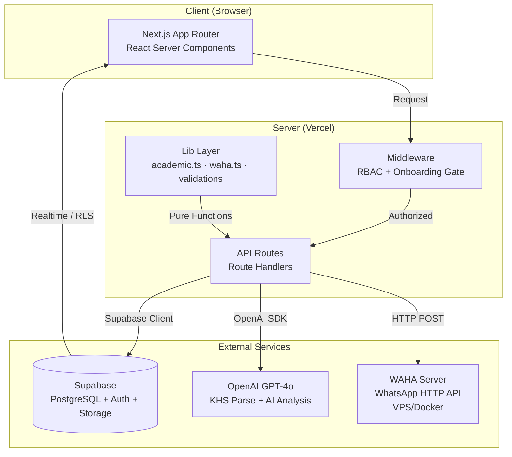

---

## 2. User Roles & Route Map

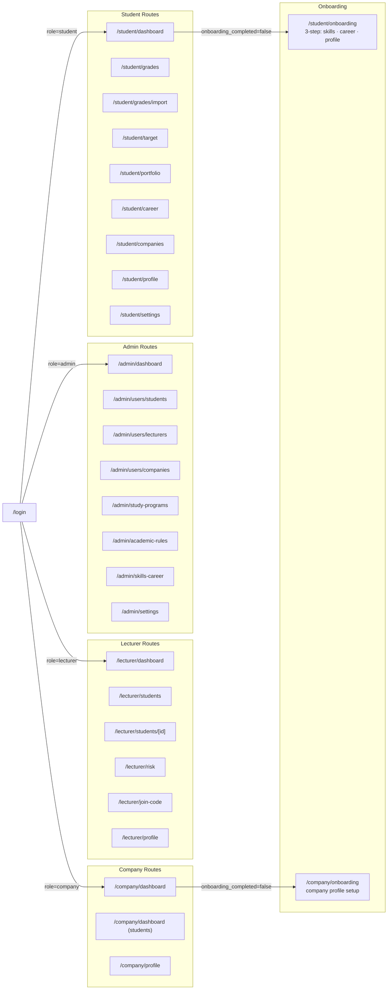

---

## 3. Database Schema (ERD)

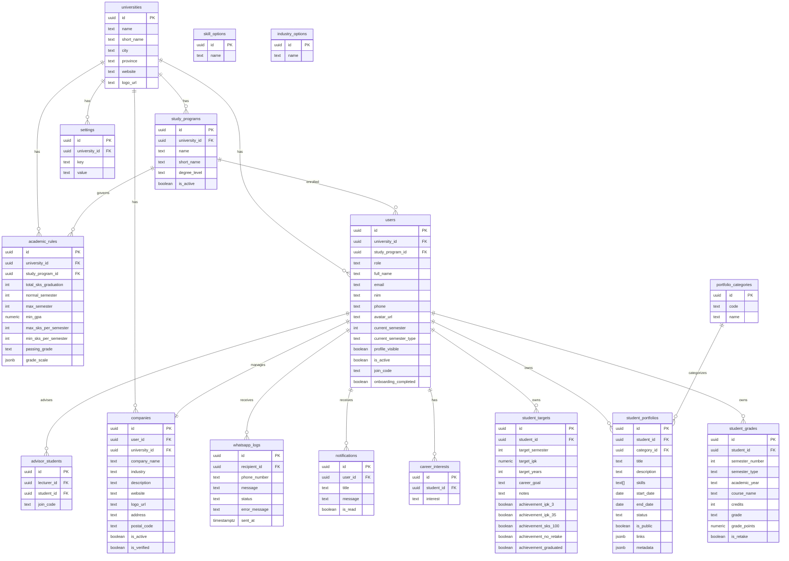

---

## 4. Authentication & Middleware Flow

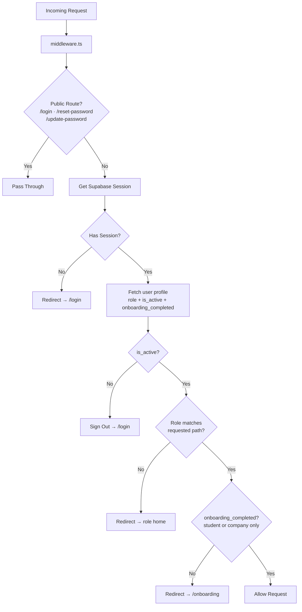

---

## 5. Academic Calculation Engine

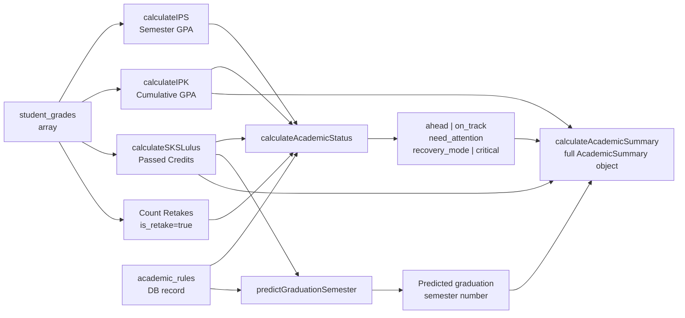

---

## 6. API Routes Map

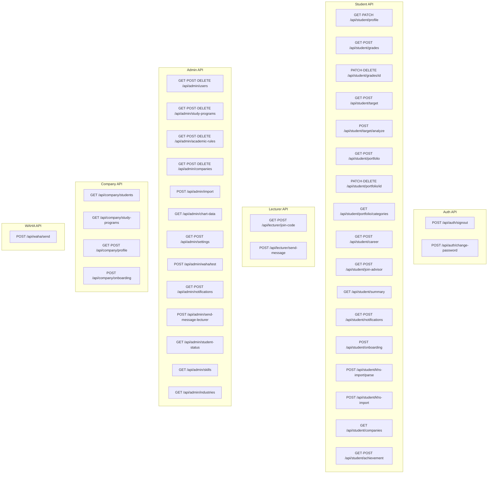

---

## 7. WAHA WhatsApp Integration Flow

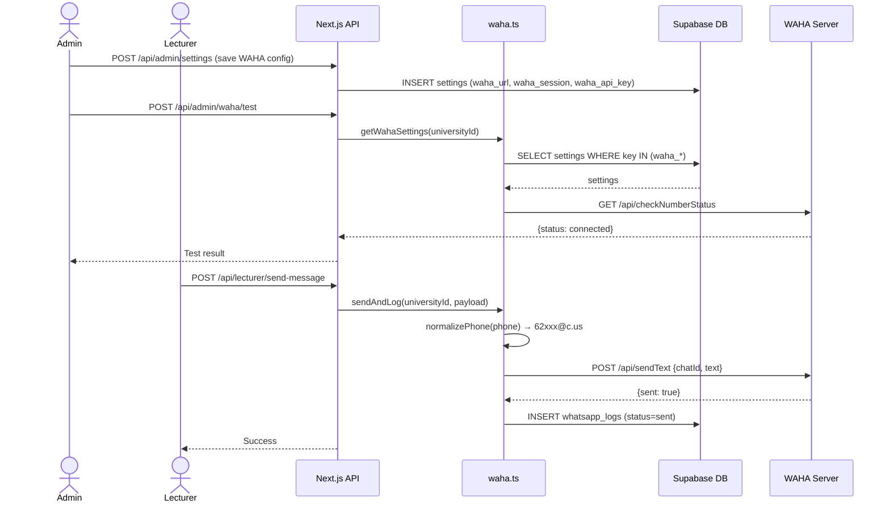

---

## 8. KHS AI Import Flow

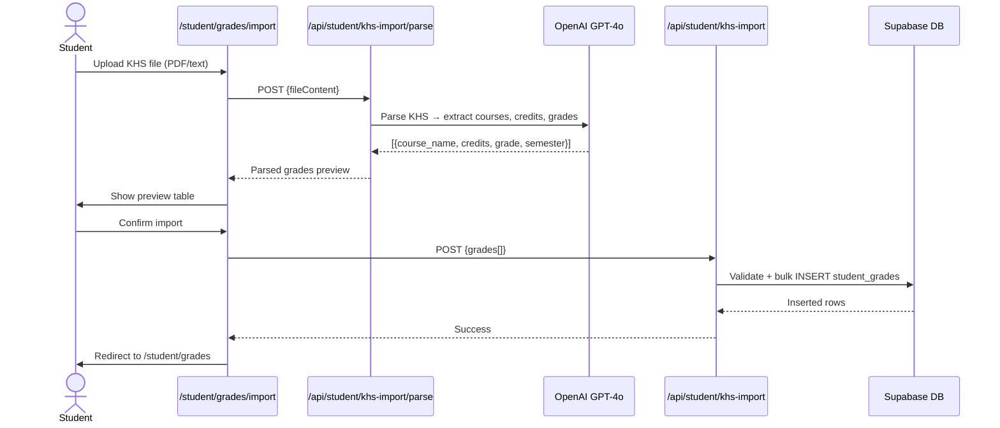

---

## 9. Company Talent Scouting Flow

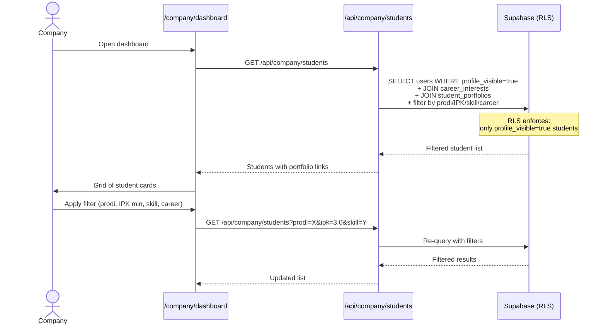

---

## 10. Component Dependency Tree

```mermaid
graph TD
    subgraph Pages["Pages (RSC)"]
        P1[student/dashboard/page.tsx]
        P2[lecturer/students/id/page.tsx]
        P3[admin/dashboard/page.tsx]
        P4[company/dashboard/page.tsx]
    end

    subgraph StudentComp["Student Components"]
        SC1[StudentIPKChart]
        SC2[StudentIPSChart]
        SC3[StudentSKSChart]
        SC4[StudentTargetChart]
        SC5[GradeFormDialog]
        SC6[PortfolioForm]
        SC7[NotificationBell]
        SC8[GraduationAchievement]
    end

    subgraph LecturerComp["Lecturer Components"]
        LC1[LecturerStatusChart]
        LC2[RiskPageClient]
        LC3[SendMessageDialog]
        LC4[JoinCodeClient]
    end

    subgraph AdminComp["Admin Components"]
        AC1[DashboardChart]
        AC2[StudentStatusChart]
        AC3[ImportCSVForm]
        AC4[WahaSettingsForm]
        AC5[StudyProgramActions]
        AC6[AcademicRuleActions]
    end

    subgraph SharedComp["Shared Components"]
        SH1[CreateUserForm]
        SH2[NotificationInbox]
        SH3[LinkPreview]
    end

    subgraph UI["shadcn/ui Primitives (31)"]
        UI1[Button · Input · Form]
        UI2[Dialog · Sheet · Tabs]
        UI3[Table · Card · Badge]
        UI4[Chart · Select · Checkbox]
        UI5[Sidebar · Toast · Avatar]
    end

    P1 --> SC1 & SC2 & SC3 & SC7
    P2 --> SC1 & SC2 & LC3
    P3 --> AC1 & AC2
    P4 --> SH3

    SC1 & SC2 & SC3 & SC4 --> UI4
    SC5 & SC6 --> UI1 & UI2
    LC1 --> UI4
    LC2 & LC3 --> UI1 & UI2 & UI3
    AC1 & AC2 --> UI4
    AC3 & AC4 --> UI1 & UI2
    SH1 --> UI1 & UI2
```

---

## 11. Deployment Architecture

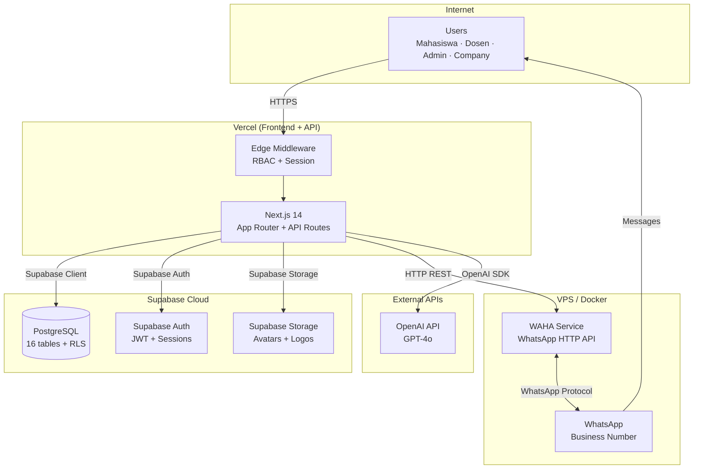

---

## 12. Development Phase Timeline (Gantt)

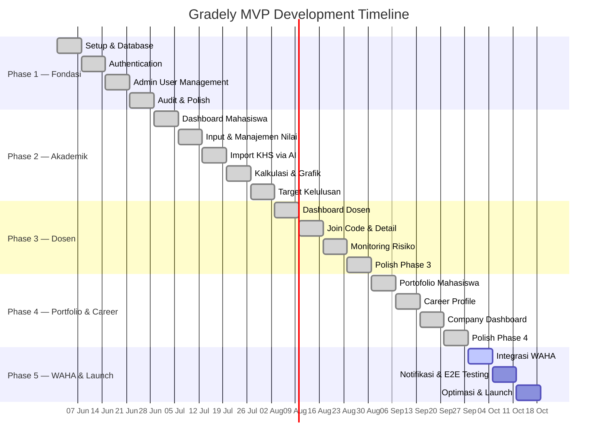
